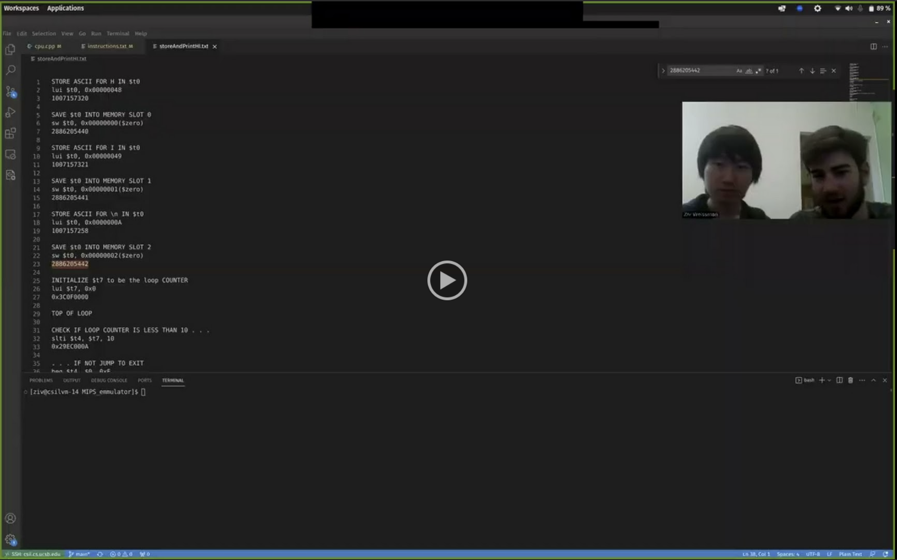

# MIPS emulator

## Project overview

This project develops a MIPS emulator in C++, by Peiyang Song* and Ziv Weissman* (names sorted by alphabet instead of evaluation of contribution). This is designed as the authors' final project for the W23 CMPTGCS 1B (Computer Organization and Logic Design) class co-taught by Dr. Jonathan Balkind and Dr. Ziad Matni (both at UCSB CoE CS, names sorted by alphabet). The authors would like to thank them for their invaluable advice and amazing lectures.

*BS candidate for Computer Science, College of Creative Studies (CCS), University of California Santa Barbara (UCSB).

## Live demo

In this section, we begin our introduction with a live demo. In the video, we first create a test file to show how our MIPS emulator successfully handle several core functions and instructions in MIPS (including loop, if-else branching, input and output, basic calculations, etc.). Then we move on to discuss how we have employed an exception handling mechanism to report possible errors.

Click here to view our (6-minute) video:

Presented by Peiyang Song (left) and Ziv Weissman (right).

## File structure

In this section, we give a brief description of each file in this repo as follows.

1. example_input.

      This folder contains:

            a) the input for our test file, in instructions.txt.
            b) the process that we used to generate the input file, in storeAndPrintHI.txt.
                                       
      * Note: 
      1) you may find both decimal and hex values in our input file, as this is supported by C++ (hex values start with 0x).
      2) specifically, what you will find in our second file is a conversion path for each input line. Every conversion path goes from the natural language description of a line's purpose, to the equivalent code in a MIPS program, and finally the corresponding machine language for this line. If there is any confusion towards our first input file, looking into its corresponding parts in our second file can be helpful.
      
2. exceptions.

      This folder contains:

            a) classes for exceptions that will be thrown when encountering errors, in Error.h.
            b) a single class signaling that we do not encounter any errors and successfully quit the program, in SuccessfulQuit.h.

3. os.cpp: simulates the function of an operating system layer.

      Main functions: 

            a) two supported ways to take inputs from users.
            b) exception handling.

4. cpu.cpp, cpu.h: simulates the function of a central processing unit layer.

      Main functions: 

            a) a CPU type consisting of an instruction set, a dynamic memory, and a program counter.
            b) a parsing algorithm to pre-process all inputed instructions.
            c) a syntax checker linked to exception handling.
            d) implemented functionality of each instruction & syscall.
                
      * Note: theoretically 'syscall' should be a part of the operating system, thus supposed to be in the os.cpp simulator instead of this cpu.cpp one. However, considering its nature as a line of instruction just like any r-, i-, or j-type instruction, we decide to have it implemented in the cpu simulator file for convenience.

5. Makefile.

      More detailed information will be elaborated in the next section.

## Supported features

In this section, we describe several core features that our MIPS simulator supports.

1. Input methods.

      We supports two approaches to fetch input instructions: 
      
            a) If a test file is detected, we directly read all the instructions from it.
            b) Otherwise, we open an interactive window, taking users inputs line by line.
                                                              
2. Exception handling.

      We defines three types of error codes, namely 
      
            a) Type 0 for unknown/unspecified errors.                                              
            b) Type 1 for invalid instruction detected from input.
            c) Type 2 for memory out of bounds errors.
                                                    
      If any one of those errors are detected, we throw a error type that is associated with the specific case, together with its location in the code (i.e., which instruction results in this particular type of error).
      
      Otherwise, if none of those three exceptions are thrown, the program exit with a successful-quit label.
      
3. Parsing algorithm.

      Given any line of instruction as input, we design a pre-processing algorithm that parses the instruction into parts of opcode, rs, rt, rd, shamt, func, immed, and address. Note that r-, i-, and j-type instructions have different formats and are consisted of different parts among the listed ones, we start with opcode because it is included in the suntax of all three types. By separating out an instruction's opcode, we can classify any instruction to be either a certain i- or j-type function or any r-type functions (because all r-type functions have opcode zero). Therefore, we only need to consider the func part additionally for r-type, and then we succeed with decoding programming language.

4. Syntax checker.

      Having identified which particular function a line of programming language implies, we take a step back from directly carrying out its functionality. Instead, we pass all the instruction through a syntax checker. A failure in this process necessarily leads to a Type 1 error in exception handling (reference item 2 in this section for information related to our exception handling mechanism).
      
5. Implemented functionality.

      Finally, we provide a list of all core instructions that we have implemented in our MIPS simulator.
      
            a) I-type: lw, sw, addi, andi, ori, slti, beq, bne, lui.
            b) R-type: add, andr*, orr*, nor, slt, sll, jr.
            c) J-type: j, jal.
      
      * Note: the 'andr' and 'orr' in the previous list are essentially the same as 'and' and 'or', respectively. We denote them with an 'r' attached at the end only because 'and' and 'or' are themselves keywords in C++, so we wish to avoid such possible confusion.

## Acknowledgement

Above we present all the main information for this project. The authors would like to once again thank Dr. Jonathan Balkind for his direct guidance of this project, which would have no chance to come true without his generous and professional help.
